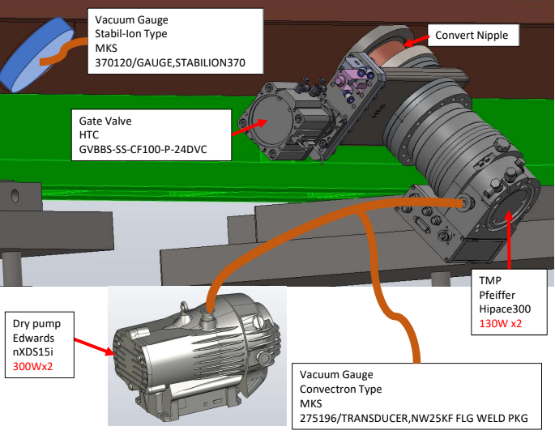
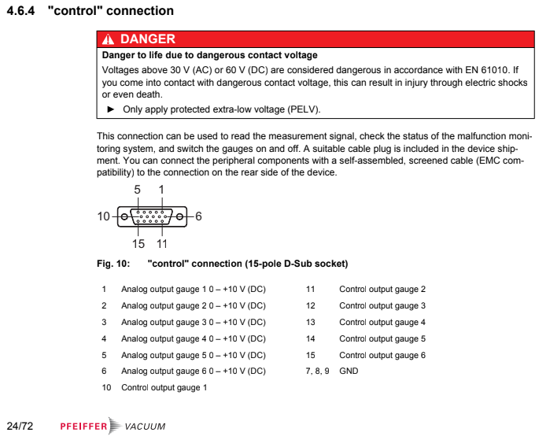
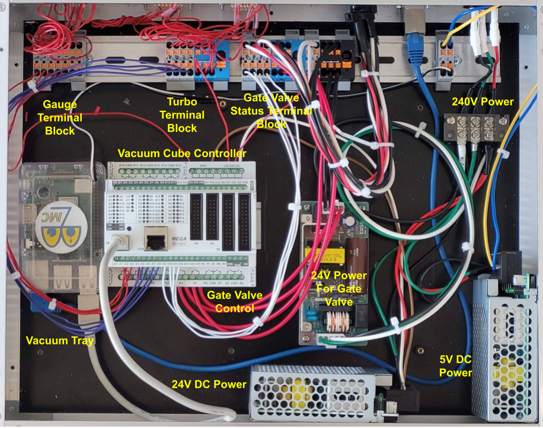
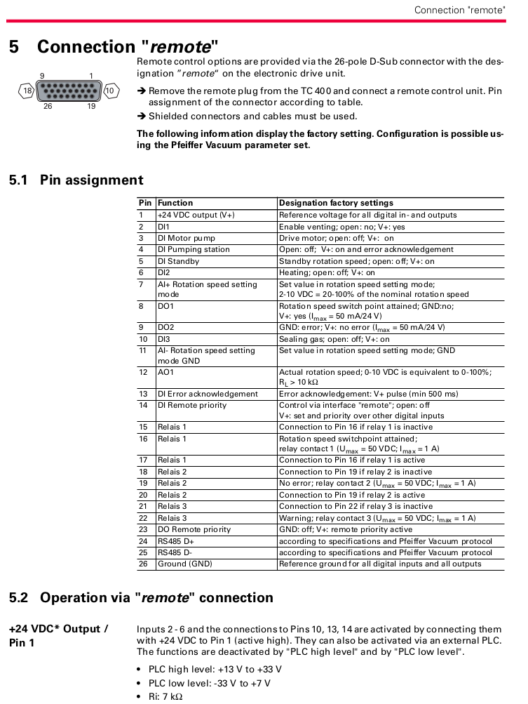

# RFQ Vacuum Cube Controller
* <a href="https://github.com/bl-mirrotron/mirrotron-rfq-vacuum-cube" target="_blank">Source code</a>
* [RFQ Vacuum System](https://docs.bl-mirrotron.com/mirrotron-rfq-vacuum-tray)
* [RFQ Vacuum system overview](https://docs.bl-mirrotron.com/#vacuum-system)
* [Control system overview](https://docs.bl-mirrotron.com/)

The RFQ has two identical vacuum systems mounted on either side of the RFQ as shown in Figure 1. The RFQ vacuum system cube controller is responsible for:
* Read vacuum gauge pressures
* Control opening and closing of valves
* Read status of gate valve limit switches
* Read status of the turbo pumps
  - Turbo pump error status
  - Turbo pump 70% speed status

The RFQ vacuum cube controller electronics are shown in Figure 2.

All RFQ vacuum gauges are connected to a  <a href="https://www.pfeiffer-vacuum.com/en/products/vacuum-generation/turbopumps/accessories-hybrid-bearing/external-drives/32066/tpg-366-indicator-and-controller-for-6-gauges" target="_blank">TPG 366 MAXIGAUGE</a> Controller. The TPG 366 MAXIGAUGE controller provides a 0-10V analog signal that is proportional to the gauge pressure. These signals are provided on the back panel control connector as shown in Figure 2. A cable then connects the control connector to the RFQ vacuum cube controller chassis are shown in Figure 3 where the signals are routed to the analog inputs of a <a href="https://www.controllino.com/product/controllino-mega/" target="_blank">Controllino Mega</a> PLC-like microcontroller. The cube controller only records the raw voltage from the gauge controller. The scaling for pressure is done in the vacuum tray.

The turbo pumps are controlled with a TC400 Electric Drive unit from Pfeiffer. The TC400 provides a remote connection as shown in Figure 4. This remote connection is routed to Controllino Mega where the turbo pump 70% threshold and error bits are monitored.

A 24 volt signal from the Controllino Mega is sent to the gate valve limit switches. The voltage of the limit switches is then returned to the Controllino Mega to detect the limit switch position.

Finally, the 24 V power for opening the gate valves is routed through a relay in the Controllino Mega to control the opening and closing of the relays.

Figure 1.  RFQ Vacuum Layout

 

Figure 1.  TPG 366 MAXIGAUGE Gauge Controller  back panel control connection

 

Figure 3.  RFQ vacuum cube controller

 

Figure 4.  TC400 remote connection pinout

 
